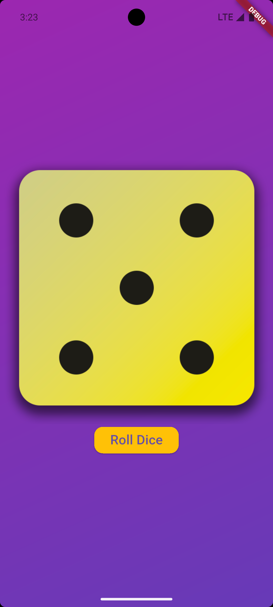

# Flutter Roll Dice App 🎲

A simple Flutter application that simulates rolling dice.  
Press a button to roll the dice and get a random result between 1 and 6.

---

## Features

- Randomized dice roll on button press
- Fun and simple UI
- Lightweight Flutter app

---

## Screenshots

  

---

